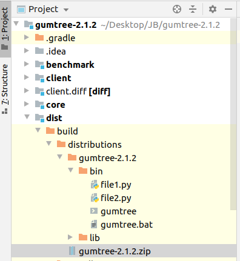
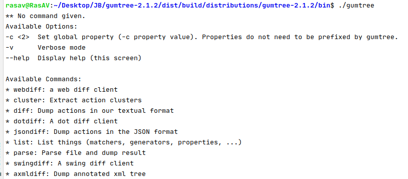

# Pythonparser

[](https://circleci.com/gh/JetBrains-Research/pythonparser)

This repository contains parsers from **Python code** to **xml/json** and vice versa.
This includes parsers for **python2** (see [pythonparser](src/main/python/pythonparser-2.py), source code from [this](https://github.com/GumTreeDiff/pythonparser) repository) and **python3** (see [pythonparser3](src/main/python/pythonparser-3.py), source code from [this](https://github.com/Varal7/pythonparser) repository  and [this](https://eth-sri.github.io/py150) project). 

We are going to support Python 3.8 in **python3** parser:
- [ ] [the "walrus" operator](https://docs.python.org/3/whatsnew/3.8.html#assignment-expressions);
- [ ] [positional-only parameters](https://docs.python.org/3/whatsnew/3.8.html#positional-only-parameters);
- [ ] [f-strings assignment](https://docs.python.org/3/whatsnew/3.8.html#f-strings-support-for-self-documenting-expressions-and-debugging);

[Here](https://docs.python.org/3/whatsnew/3.8.html) you can read about all new features that Python 3.8 provides.


## Installation
- python2:  
    `pip install -r requirements.txt`
  
- python3:  
    `pip3 install -r requirements.txt`  
- python3 tests:
    `pip3 install -r requirements-test.txt` 

## Getting started
- python2:  
    `python pythonparser_2 path_to_src_file.py`
  
- python3:  
    `python3 pythonparser_3 path_to_src_file.py`

To run tests for **python3** parser:

`python3 -m pytest`


## Examples of usage

Here are several examples of using **python3** parser.

<details><summary>First example</summary>

<p>

``` python
a = 5
b = 16.5
print(a + b)
```

</p>

<p>

``` xml
<Module lineno="1" col="0" end_line_no="3" end_col="12">
	<Assign lineno="1" col="0" end_line_no="1" end_col="5">
		<Name_Store value="a" lineno="1" col="0" end_line_no="1" end_col="1">
		</Name_Store>
		<Constant-int value="5" lineno="1" col="4" end_line_no="1" end_col="5">
		</Constant-int>
	</Assign>
	<Assign lineno="2" col="0" end_line_no="2" end_col="8">
		<Name_Store value="b" lineno="2" col="0" end_line_no="2" end_col="1">
		</Name_Store>
		<Constant-float value="16.5" lineno="2" col="4" end_line_no="2" end_col="8">
		</Constant-float>
	</Assign>
	<Expr lineno="3" col="0" end_line_no="3" end_col="12">
		<Call lineno="3" col="0" end_line_no="3" end_col="12">
			<Name_Load value="print" lineno="3" col="0" end_line_no="3" end_col="5">
			</Name_Load>
			<BinOp_Add lineno="3" col="6" end_line_no="3" end_col="11">
				<Name_Load value="a" lineno="3" col="6" end_line_no="3" end_col="7">
				</Name_Load>
				<Name_Load value="b" lineno="3" col="10" end_line_no="3" end_col="11">
				</Name_Load>
			</BinOp_Add>
		</Call>
	</Expr>
</Module>
```

</p>

</details>

<details><summary>Second example</summary>

<p>

``` python
# Test example

from ast import NodeVisitor


class Example(NodeVisitor):
    def generic_visit(self, node):
        print(type(node).__name__)
        NodeVisitor.generic_visit(self, node)
```

</p>

<p>

``` xml
<Module lineno="1" col="0" end_line_no="9" end_col="45">
	<ImportFrom-0 value="ast" lineno="3" col="0" end_line_no="3" end_col="27">
		<alias value="NodeVisitor" lineno="3" col="0" end_line_no="3" end_col="4">
		</alias>
	</ImportFrom-0>
	<ClassDef value="Example" lineno="6" col="0" end_line_no="9" end_col="45">
		<bases lineno="6" col="0" end_line_no="9" end_col="45">
			<Name_Load value="NodeVisitor" lineno="6" col="14" end_line_no="6" end_col="25">
			</Name_Load>
		</bases>
		<keywords lineno="6" col="0" end_line_no="9" end_col="45">
		</keywords>
		<body lineno="6" col="0" end_line_no="9" end_col="45">
			<FunctionDef value="generic_visit" lineno="7" col="4" end_line_no="9" end_col="45">
				<arguments lineno="7" col="22" end_line_no="7" end_col="32">
					<posonlyargs lineno="7" col="22" end_line_no="7" end_col="32">
					</posonlyargs>
					<args lineno="7" col="22" end_line_no="7" end_col="32">
						<arg value="self" lineno="7" col="22" end_line_no="7" end_col="26">
						</arg>
						<arg value="node" lineno="7" col="28" end_line_no="7" end_col="32">
						</arg>
					</args>
					<kwonlyargs lineno="7" col="22" end_line_no="7" end_col="32">
					</kwonlyargs>
					<kw_defaults lineno="7" col="22" end_line_no="7" end_col="32">
					</kw_defaults>
					<defaults lineno="7" col="22" end_line_no="7" end_col="32">
					</defaults>
				</arguments>
				<body lineno="7" col="4" end_line_no="9" end_col="45">
					<Expr lineno="8" col="8" end_line_no="8" end_col="34">
						<Call lineno="8" col="8" end_line_no="8" end_col="34">
							<Name_Load value="print" lineno="8" col="8" end_line_no="8" end_col="13">
							</Name_Load>
							<Attribute_Load lineno="8" col="14" end_line_no="8" end_col="33">
								<Call lineno="8" col="14" end_line_no="8" end_col="24">
									<Name_Load value="type" lineno="8" col="14" end_line_no="8" end_col="18">
									</Name_Load>
									<Name_Load value="node" lineno="8" col="19" end_line_no="8" end_col="23">
									</Name_Load>
								</Call>
								<attr value="__name__" lineno="8" col="14" end_line_no="8" end_col="33">
								</attr>
							</Attribute_Load>
						</Call>
					</Expr>
					<Expr lineno="9" col="8" end_line_no="9" end_col="45">
						<Call lineno="9" col="8" end_line_no="9" end_col="45">
							<Attribute_Load lineno="9" col="8" end_line_no="9" end_col="33">
								<Name_Load value="NodeVisitor" lineno="9" col="8" end_line_no="9" end_col="19">
								</Name_Load>
								<attr value="generic_visit" lineno="9" col="8" end_line_no="9" end_col="33">
								</attr>
							</Attribute_Load>
							<Name_Load value="self" lineno="9" col="34" end_line_no="9" end_col="38">
							</Name_Load>
							<Name_Load value="node" lineno="9" col="40" end_line_no="9" end_col="44">
							</Name_Load>
						</Call>
					</Expr>
				</body>
				<decorator_list lineno="7" col="4" end_line_no="9" end_col="45">
				</decorator_list>
			</FunctionDef>
		</body>
		<decorator_list lineno="6" col="0" end_line_no="9" end_col="45">
		</decorator_list>
	</ClassDef>
</Module>
```

</p>

</details>

### Tree format

This section describes the format of the tree that **python3** parser produces.  

The produced tree is a valid XML document. Each node in the document corresponds to a node
of Python Abstract syntax tree (AST).
Since the second version of the [GumTree](https://github.com/GumTreeDiff/gumtree) library takes into account only the label of the node, 
the `value` attribute, the token position attributes, and nothing else, we have to include 
additional information about some nodes into their labels.
So, it is necessary to note several nuances of the format:  
1. Operations are directly included into the label of the node. They follow `the underscore`.

    <details><summary>Example</summary>

    A node with the `BinOp_Add` label is a `BinOp` (binary operation) node
    and the operation of that node is addition.

    </details>
2. [Expression context](https://greentreesnakes.readthedocs.io/en/latest/nodes.html#Load) 
is directly included into the label of the nod. It follows `the underscore`.
 
    <details><summary>Example</summary>
    
    <p>

    A node with the `Name_Load` label is a `Name` node
    and the context of that `Name` is `Load`, which means that we "load" or "read" the
    content held by the `Name` node
    
    </p>
    
    </details>
3. The type of the value contained in the constant node (`Constant`, `Num`, `Str`) is directly included into the label of the node.
   It follows `the hyphen`. 
 
   <details><summary>Example</summary>
	
   <p>

   A node with the `Constant-float` label is the `Constant` node
   and the value contained in it has the `float` type.
   
   </p>
    
   </details>

4. [Import level](https://greentreesnakes.readthedocs.io/en/latest/nodes.html#ImportFrom) is directly included 
into the `ImportFrom` node label. It follows `the hyphen`. 
   <details><summary>Example</summary>
	
   <p>

   A node with the `ImportFrom-3` label is an `ImportFrom` node
   and the import level is 3.
   
   </p>
    
   </details>
  
*Note*: Token position attributes are: `lineno`, `col`, `end_line_no`, `end_col`. They exist in order to determine the position of the token.

### How to run Gumtree with Python parser

This is a guide on how to use [GumTree](https://github.com/GumTreeDiff/gumtree) with Pythonparser.

1. Download GumTree

   <details><summary>More details</summary>
	
   <p>

   The stable version of GumTree can be found [here](https://github.com/GumTreeDiff/gumtree/releases/tag/v2.1.2). 
   The version is `2.1.2`, you should download the source code. Do not 
   clone the repository, because it will give you an unstable version.
   
   </p>
    
   </details>
   
2. Build GumTree

   <details><summary>More details</summary>
	
   <p>

   After you downloaded and extracted the archive, open it as a new IDEA project. While you are in the root, 
   open the IDEA terminal (console), and build this project by 
   running `./gradlew build -x test` for UNIX systems and `gradlew.bat build -x test` on Windows 
   (it can have some troubles with Windows, see [this issue](https://github.com/GumTreeDiff/gumtree/issues/72)).
   
   </p>
   
   <p>

   To check if this step is done — new folder `build` should appear in the `/dist` directory. 
   To get the runnable bash-script you should extract the archive `gumtree-2.1.2.zip` in  
   `build/distributions/`. Do it manually and put all the files in the same directory. 
   Create two files that you want to compare as a test. The resulting directory tree should look like this:
   
   </p>
   
   <p>
   
   
   
   </p>
   
   <p>
   
   Now you can check if this bash script works: 
   run `./gumtree` command in the terminal with no parameters. If you receive this message, then everything is fine:
   
   </p>
   
   <p>
   
   
   
   </p>
    
   </details>
   
3. Add Pythonparser

   <details><summary>More details</summary>
   
   <p>
   
   Originally pythonparser came from [this](https://github.com/GumTreeDiff/pythonparser) repository. 
   But it was modified by us and now you can use the version from the current repository.
   
   </p>
   
   <p>
   
   - Firstly, download `requirements.txt` from the repository [here](./requirements.txt) and put it in the root of your 
   _gumtree project_. Install all the requirements by running `pip3 install -r requirements.txt` in the IDEA terminal.
   
   </p>
   
   <p>
   
   - Secondly, take [pythonparser_3.py](./src/main/python/pythonparser/pythonparser_3.py) 
   and place it into the `/tmp` directory on your laptop. Rename the file into `"pythonparser"`, 
   without any extensions like `".py"`. The type of this file should be "Python 3 script (text/x-python3)". 
   If it is different, check the header of the file. The first line should be `"#!/usr/bin/env python3"`. 
   Make this file executable by running `chmod +x /pathToYourFile/pythonparser`.
   
   </p>
   
   <p>
   
   - Next, add the `/tmp` directory to the `gumtree project PATH`. If you want to do it temporarily (before reboot), 
   then open the terminal in the GumTree project in `/dist/build/distributions/gumtree-2.1.2/bin` directory 
   and insert: `export PATH=$PATH:/tmp`. This command temporary (before reboot) adds `/tmp` to the list of directories 
   where your project will check for the parser file. You can check if it is added to the PATH by using echo `$PATH`. 
   
   </p>
   
   </details>
   
4. Run Gumtree with python parser

   <details><summary>More details</summary>
   
   <p>
   
   Now everything is done and you can run the project using `./gumtree diff file1.py file2.py`.
   
   </p>
   
   </details>
